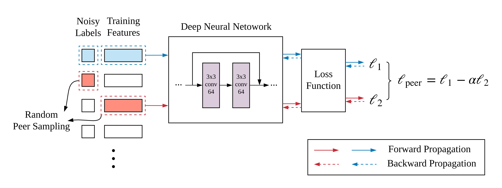
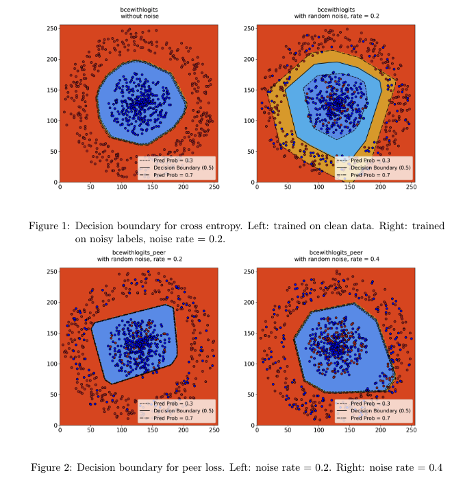

# Peer Loss functions

This repository is the (Multi-Class & Deep Learning) Pytorch implementation of "[Peer Loss Functions: Learning from Noisy Labels without Knowing Noise Rates](https://arxiv.org/abs/1910.03231)" accepted by ICML2020. 


## Required Packages & Environment
**Supported OS:** Windows, Linux, Mac OS X; Python: 3.6/3.7; 

**Deep Learning Library:** PyTorch (GPU required)

**Required Packages:** Numpy, Pandas, random, sklearn, tqdm, csv, torch (Keras is required if you want to estimate the noise transition matrix).


## Utilities
This repository includes:

📋 Multi-class implementation of Peer Loss functions;

📋 Peer Loss functions in Deep Learning;

📋 Dynamical tunning strategies of Peer Loss functions to further improve the performance.

Details of running (weighted) Peer Loss functions on MNIST, Fashion MNIST, CIFAR-10, CIFAR-100 with different noise setting are mentioned in the `README.md` file in each folder.

The workflow of weighted Peer Loss functions comes to:




## Decision boundary visualization
Given a 2D syntheric dataset, the decision boundaries returned by training with Cross-entropy loss become loose when the noise rate is high. However, the decision boundaries w.r.t. Peer Loss functions remain tight despite high presence of label noise.




## Citation

If you use our code, please cite the following paper:

```
@inproceedings{liu2020peer,
  title={Peer loss functions: Learning from noisy labels without knowing noise rates},
  author={Liu, Yang and Guo, Hongyi},
  booktitle={International Conference on Machine Learning},
  pages={6226--6236},
  year={2020},
  organization={PMLR}
}
```

## Related Code
📋 Peer Loss functions and its experiments on UCI datasets is available at:
**https://github.com/gohsyi/PeerLoss**

📋 The following work extends Peer Loss functions to a family of divergence-type robust loss functions and is available at:
**https://github.com/weijiaheng/Robust-f-divergence-measures**
The corresponding paper is "[When Optimizing f-Divergence is Robust with Label noise](https://arxiv.org/abs/2011.03687)" accepted by ICLR2021. 

## Thanks for watching!
